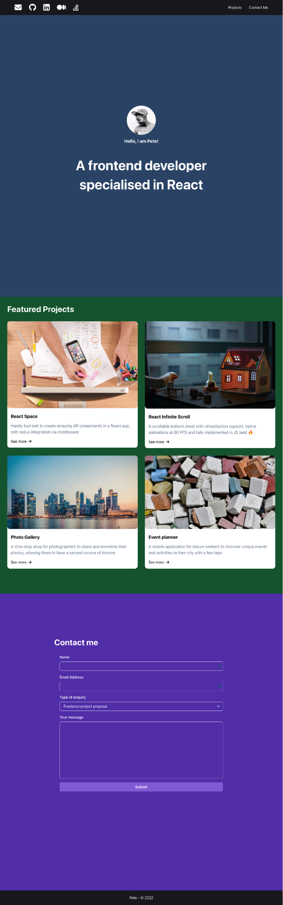

# Advanced React Final Lab

## Task

In this final lab, I created a single-page portfolio that contained the following sections:

 - A header with external links to social media accounts and internal links to other sections of the page

 - A landing section with an avatar picture and a short bio

 - A section to display your featured projects as cards in a grid fashion

 - A contact me section with a form to allow visitors to contact you

I used some popular open source libraries to have more professional looking page.

## Live Demo
🖇 Live Demo: [here](https://timely-semifreddo-66971b.netlify.app/)

## Libraries

#### Chakra UI

#### Formik and Yup

## Steps

